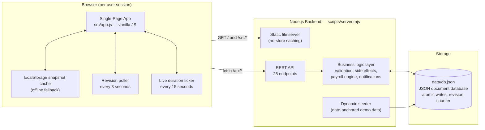
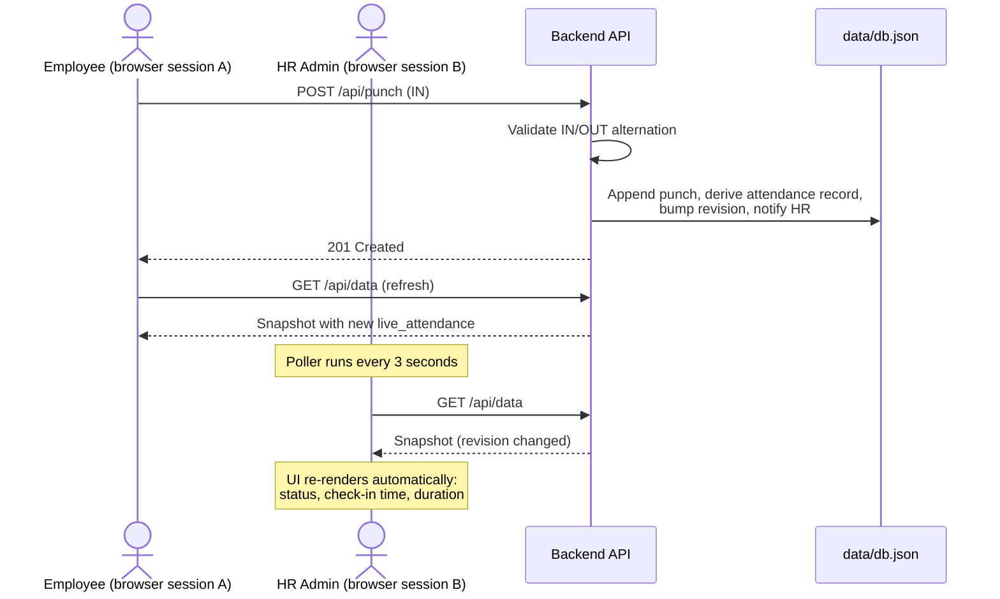
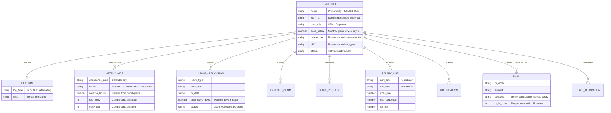
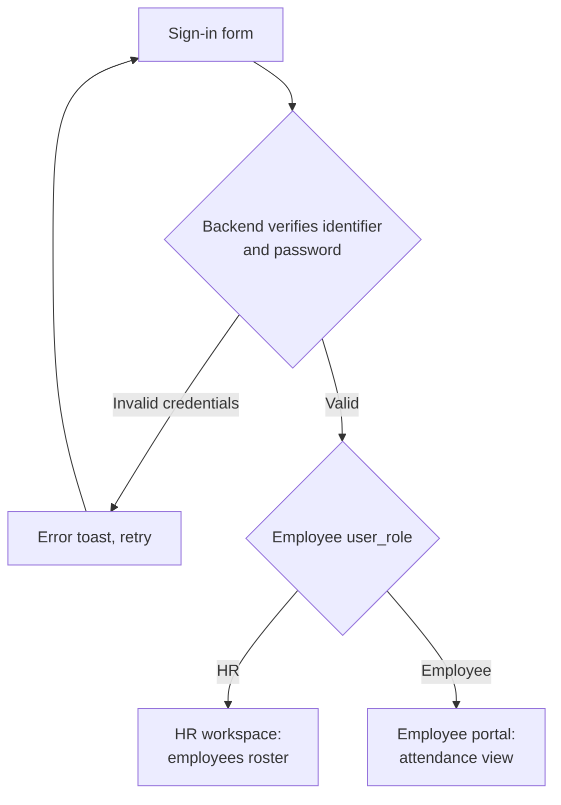
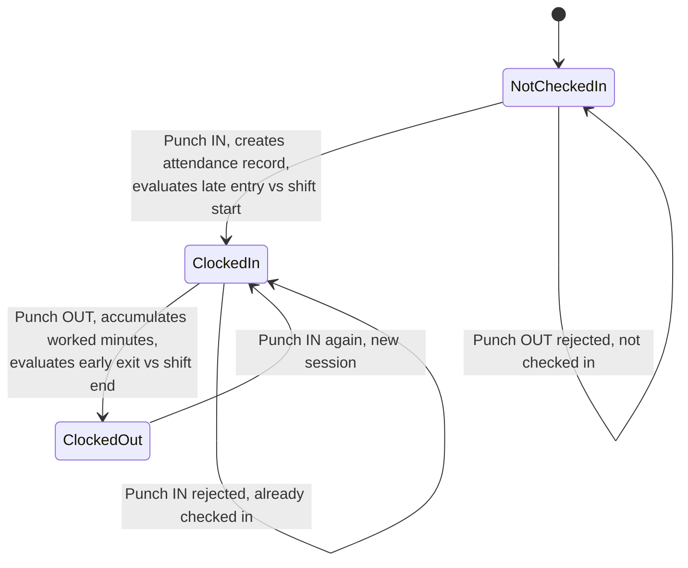
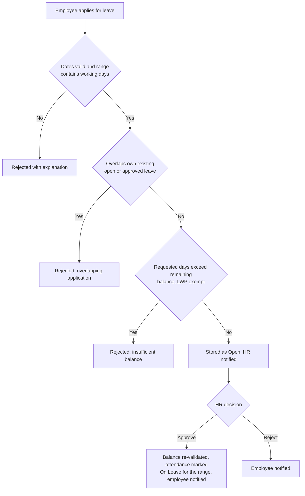
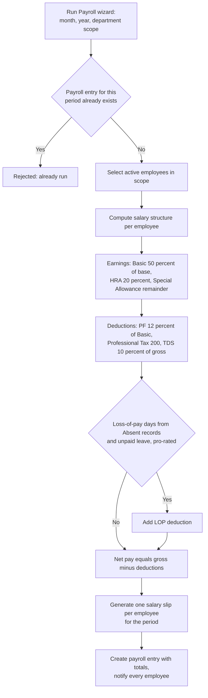
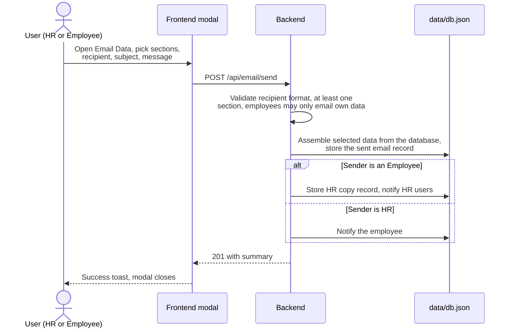

# Dayflow HRMS — Human Resource Management System

A complete, self-contained Human Resource Management System for small and mid-sized organizations. Dayflow provides two separated portals — an **HR / Admin workspace** and an **Employee self-service portal** — backed by a real REST API server with server-side business logic, a JSON document database, and automatic cross-portal synchronization.

The project is intentionally dependency-free: the backend is built on the Node.js core `http` module and the frontend is a single-page application written in vanilla JavaScript. No frameworks, no external services, no database server required.

---

## Table of Contents

1. [Overview](#overview)
2. [Feature Matrix](#feature-matrix)
3. [Architecture](#architecture)
4. [Real-Time Synchronization Model](#real-time-synchronization-model)
5. [Domain Model](#domain-model)
6. [Core Workflows](#core-workflows)
   - [Authentication and Roles](#authentication-and-roles)
   - [Attendance and Punch Lifecycle](#attendance-and-punch-lifecycle)
   - [Leave Management](#leave-management)
   - [Payroll Engine](#payroll-engine)
   - [Email Employee Data](#email-employee-data)
7. [REST API Reference](#rest-api-reference)
8. [Business Rules Summary](#business-rules-summary)
9. [Getting Started](#getting-started)
10. [Project Structure](#project-structure)
11. [Security Model](#security-model)
12. [Production Considerations](#production-considerations)

---

## Overview

Dayflow models the day-to-day HR operations of a company:

- **HR / Admin portal** — workforce roster with live attendance indicators, real-time attendance board, leave approvals, expense claim approvals, shift request approvals, employee creation with auto-generated credentials and photo upload, payroll overview with a guided run wizard, salary slip browser, reports and analytics, company announcements, and settings.
- **Employee portal** — personal attendance calendar and check-in/out punching, leave balances and applications, payslips, expense claims, shift change requests, team directory, announcements, notifications, and a personal profile with photo upload.

Every action in either portal is persisted through the backend, which is the **single source of truth**. All derived values — attendance summaries, leave balances, payroll amounts, dashboard statistics, reports — are computed from the database of record, never hard-coded.

The system ships with realistic demo data (nine employees, attendance history, leaves, payroll history) that is **anchored to the current date** on seed, so the demo always looks alive whenever it is started.

---

## Feature Matrix

| Capability | HR / Admin Portal | Employee Portal |
| --- | --- | --- |
| Sign in / sign up / password reset | Company workspace signup, password-verified sign in | Password-verified sign in, password reset |
| Employee roster with live status | Card grid with Present / Checked Out / On Leave / Absent indicators, search and department filters | Team directory |
| Attendance | Real-time board (check-in, check-out, live work duration, punch timeline), monthly records | Monthly calendar and list view, punch page with live clock and worked-hours ticker |
| Check in / check out | Via topbar systray | Via topbar systray or punch page |
| Leave management | Approval queue, approve / reject with side effects, balances per employee | Balance cards (remaining vs. consumed), apply with validation, application history |
| Expense claims | Approve / reject, sanctioned amounts, totals | Submit claims, track status |
| Shift requests | Approve (applies new shift to employee) / reject | Submit shift change requests |
| Payroll | Overview with computed totals, 3-step run wizard, salary slip browser with breakdowns | Personal payslip breakdown and history |
| Reports and analytics | Headcount by department, leave utilization, payroll trajectory, monthly attendance, turnover | — |
| Email employee data | Send any employee's data (selected sections) to any recipient | Send own data; HR automatically receives a copy |
| Announcements | Publish (notifies all employees) | Read |
| Notifications | Actionable feed with unread badge | Personal feed with unread badge |
| Profile | View-only employee documents, edit employee details, photo upload | Edit contact info, upload photo, email own data |
| Data reset | Reset workspace to fresh demo state | — |

Recruitment and onboarding entities (job openings, applicants, interviews, onboarding checklists) also exist at the API and data level for extension purposes, but their dedicated UI section is outside the current product scope.

---

## Architecture

Dayflow uses a thin-client, fat-server split: all business rules, validations, and derived computations live in the backend; the frontend renders state and calls the API.



Key properties:

- **Single source of truth.** Clients never push the whole database. Every mutation goes through a dedicated endpoint that validates input, applies side effects, and persists atomically (write to a temp file, then rename).
- **Revision-based sync.** Every mutation increments a `rev` counter. Clients poll `GET /api/data` and swap their snapshot only when the revision changed, so concurrent HR and Employee sessions converge without clobbering each other.
- **Computed snapshot.** Every `GET /api/data` response includes derived data computed server-side: `live_attendance` (per-employee real-time status) and `leave_balances` (allocated, consumed, remaining). Both portals render identical, consistent numbers.
- **Offline fallback.** If the server is unreachable, the app keeps working against the cached snapshot with local mutations, and re-syncs when the server returns.

---

## Real-Time Synchronization Model

The diagram below shows how an action taken in the Employee portal appears in an open HR session within seconds, without any manual refresh:



Elapsed-time displays (active work duration, "Since" labels) are recomputed client-side every 15 seconds from the punch records the client already holds, so they tick continuously between server updates.

---

## Domain Model

The database is a single JSON document with named collections:



Supporting collections: `shift_types` (named shifts with start and end times), `holidays` (company holiday calendar), `announcements`, `onboarding_records`, `job_openings`, `job_applicants`, `interviews`, `payroll_entries`, and lookup lists for `departments` and `designations`.

---

## Core Workflows

### Authentication and Roles

- Sign-in accepts a **Login ID, company email, personal email, or employee ID**, plus a password that is verified against the server database. Passwords are never included in any API response.
- The role (`HR / Admin` or `Employee`) is derived from the employee record's `user_role` field and determines the portal, navigation, and route access. Employee sessions are blocked from HR-only routes.
- New employees receive a **system-generated Login ID** with the format `[CompanyPrefix][FN2][LN2][JoiningYear][Serial]` (for example `DTNIVE20230002`) and a temporary password, shown to HR in a credentials dialog at creation time.
- HR company signup creates the first administrator account for a new workspace.



### Attendance and Punch Lifecycle

Punching enforces a strict alternation between IN and OUT per employee per day. Every punch automatically creates or updates that day's attendance record, computing working hours from all IN/OUT pairs and flagging late entry or early exit against the employee's assigned shift times.



The HR real-time board shows, per employee: live status (Present, Checked Out, On Leave, Not Checked In), the latest check-in time (updates on every check-in), the latest check-out time, active work duration, shift type, and a punch timeline dialog.

### Leave Management

Leave handling enforces quota and overlap rules server-side, and approvals carry side effects:



Leave day counts consider **working days only** — weekends and company holidays are excluded from both requested days and approved consumption. Balances shown everywhere are remaining balances: allocation minus approved leaves.

### Payroll Engine

The guided wizard (configure period, preview salaries, confirm and disburse) drives a server-side computation engine:



The same engine generated the seeded payroll history, so historical slips and newly generated slips are always numerically consistent.

### Email Employee Data

Both portals can package an employee's data into a tracked email record. The modal lets the sender choose which sections to include (profile, attendance records, leave history, payslips), with live record counts and an auto-generated message that updates as sections are toggled.



---

## REST API Reference

All endpoints exchange JSON. Mutating endpoints validate input server-side and return structured errors (`{ "error": "message" }`) with appropriate HTTP status codes.

### Authentication

| Method | Endpoint | Description |
| --- | --- | --- |
| POST | `/api/login` | Password-verified sign in; returns employee and role |
| POST | `/api/auth/signup` | HR company registration; creates the admin account |
| POST | `/api/auth/forgot-password` | Reset password by identifier |

### Data and System

| Method | Endpoint | Description |
| --- | --- | --- |
| GET | `/api/data` | Full snapshot with computed `live_attendance`, `leave_balances`, and `rev`; passwords stripped |
| POST | `/api/reset` | Reseed the workspace with fresh date-anchored demo data |

### Employees and Profile

| Method | Endpoint | Description |
| --- | --- | --- |
| GET / POST | `/api/employees` | List employees / create employee (auto Login ID, password, leave allocation) |
| PUT | `/api/employees/:id` | Update employee record (details, status, photo, salary) |
| PUT | `/api/profile` | Self-service contact and emergency info update |

### Attendance

| Method | Endpoint | Description |
| --- | --- | --- |
| POST | `/api/punch` | Check in or out with alternation validation; derives the attendance record; returns live status |

### Leave

| Method | Endpoint | Description |
| --- | --- | --- |
| GET / POST | `/api/leaves` | List / apply with balance, overlap, and working-day validation |
| POST | `/api/leaves/:id/approve` | Approve with re-validation; marks attendance; notifies the employee |
| POST | `/api/leaves/:id/reject` | Reject and notify |

### Expenses and Shifts

| Method | Endpoint | Description |
| --- | --- | --- |
| POST | `/api/expenses` | Submit claim; notifies the approver |
| POST | `/api/expenses/:id/approve` and `/reject` | Approve (sanctions the amount) or reject; notifies the employee |
| POST | `/api/shift-requests` | Submit a shift change request |
| POST | `/api/shift-requests/:id/approve` and `/reject` | Approve (applies the shift to the employee) or reject; notifies |

### Payroll and Notifications

| Method | Endpoint | Description |
| --- | --- | --- |
| POST | `/api/payroll/run` | Run payroll for a month, year, and department scope; duplicate runs blocked |
| POST | `/api/notifications/read-all` | Mark the caller's notifications as read |

### Communication

| Method | Endpoint | Description |
| --- | --- | --- |
| POST | `/api/announcements` | Publish an announcement; notifies all active employees |
| POST | `/api/email/send` | Send an employee data email (section selection, HR copy for employee senders, stored records) |

### Extension-Level (no dedicated UI section)

| Method | Endpoint | Description |
| --- | --- | --- |
| POST | `/api/job-openings` | Create a job opening |
| POST | `/api/applicants`, PUT `/api/applicants/:id` | Add applicant / move pipeline stage |
| POST | `/api/interviews` | Schedule an interview (parses the time window) |
| PUT | `/api/onboarding/:id` | Toggle an onboarding checklist activity |

---

## Business Rules Summary

- **Punching**: IN and OUT must strictly alternate per day; punches are timestamped by the server; each punch updates the day's attendance record with working hours and late-entry and early-exit flags relative to the employee's shift.
- **Leave days**: counted as working days (weekends and holidays excluded); balances are allocation minus approved consumption; overlapping applications are rejected; approval re-validates the balance at decision time.
- **Approvals**: approving a shift request updates the employee's assigned shift; approving a leave marks attendance; every decision generates a notification to the affected employee.
- **Payroll**: earnings and statutory deductions are derived from `base_salary`; loss of pay is pro-rated from explicit Absent records and unpaid leave; one slip per employee per period; a period cannot be run twice.
- **Email data**: employees may only email their own data; HR receives an automatic copy of employee-initiated sends; all sends are stored as auditable records.
- **Notifications**: generated by submissions, decisions, announcements, payroll runs, and email sends — never static.
- **Identifiers**: employee IDs (`EMP-###`) and document names (`LEAVE-YYYY-###`, `EXP-YYYY-###`, `SLIP-YYYY-MM-###`, `EML-YYYY-###`) are generated server-side without collisions.

---

## Getting Started

### Prerequisites

Node.js 18 or newer. No npm packages need to be installed — the project has zero runtime dependencies.

### Run in development

```bash
npm run dev
```

Starts the backend and static server at `http://localhost:4173`. Open it in a browser; the sign-in page loads with demo credentials pre-filled.

### Demo accounts

| Portal | Login ID | Email | Password |
| --- | --- | --- | --- |
| HR / Admin | `DTADSH20220001` | `hr@dayflow.local` | `Dayflow@123` |
| Employee | `DTNIVE20230002` | `nisha@dayflow.local` | `Dayflow@123` |

Employees can also sign in with their company email or employee ID (for example `EMP-002`).

### Other commands

```bash
npm run check                              # Syntax-check the frontend
npm run build                              # Copy the app into dist/ for static hosting
node scripts/server.mjs --reseed           # Start with fresh demo data
node scripts/server.mjs --reseed --reseed-only   # Reseed the database and exit
```

The in-app Settings page exposes the same reset via `POST /api/reset`. Seeded demo data (nine employees, a month of attendance history, today's punches, leave applications, and two months of payroll with computed slips) is generated relative to the current date, so every fresh seed looks like a live company on the day you start it.

### Two-session demo

Open two browser windows side by side, sign in as HR in one and as an employee in the other, then punch or apply for leave — the opposite session updates itself within about three seconds.

---

## Project Structure

```
Human-Resource-Management-System/
├── index.html                 App shell, loads src/app.js
├── package.json               Scripts only (dev, build, check) — zero dependencies
├── scripts/
│   ├── server.mjs             Backend: HTTP server, REST API, business logic, seeder
│   └── build.mjs              Production copy into dist/
├── src/
│   ├── app.js                 Single-page application (views, modals, API client, sync)
│   └── app.css                Complete design system and component styles
├── data/
│   └── db.json                JSON document database (created and seeded on first run)
└── dist/                      Production bundle output
```

Inside `src/app.js`, the frontend is organized into numbered sections: seed data, the store engine with the API client and revision poller, the session store, toasts, modals, utilities (live attendance calculation, date and formatting helpers), the router, view templates for every route, action handlers (API-first with offline fallback), modal dialogs, and bootstrap initialization.

---

## Security Model

This project is a demo and internal-grade application; within that scope it implements a meaningful baseline:

- **Passwords are verified server-side** and are stripped from every API response; sign-in without the backend is refused rather than silently allowed.
- **The database file is not web-readable**: requests under `/data/` return `403 Forbidden`, so `db.json` is never served to browsers.
- **Authorization rules**: employees can only mutate their own records and can only email their own data; HR operations are separate endpoints; route guards keep employees out of HR screens.
- **Static assets are served with `Cache-Control: no-store`** so code and content updates always reach the browser.
- **Writes are atomic** (temporary file plus rename) to reduce corruption risk on crashes.

---

## Production Considerations

If you take this beyond a demo or internal tool, plan for the following:

- **Transport security**: terminate HTTPS in front of the Node server.
- **Real authentication**: replace the demo credential store with hashed passwords (bcrypt or argon2) and session tokens; the current login flow is intentionally simple.
- **Database**: swap `data/db.json` for a real database (SQLite or PostgreSQL); the storage layer is isolated behind the server module and all mutations are serialized.
- **Email delivery**: `POST /api/email/send` currently records fully assembled emails in the database; connect an SMTP provider to deliver them for real.
- **Multi-process safety**: the server is single-process by design; run one instance per database.
- **CORS**: currently open for local development; restrict allowed origins in production.

---

## License

Provided as-is for learning and internal use. All demo employee data, names, and photographs are fictional.
